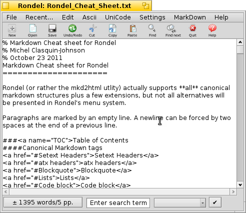

# Rondel

by Michel Clasquin-Johnson

Rondel is a Markdown-capable Text Editor with built-in ability to generate HTML and PDF  files from Markdown files.

Versioning: the first number refers to the major version of Trope on which this program is built. The second number refers to Rondel-specific changes. The third number refers to updates of the Markdown dependency

Written in yab using the Yabadabbadoo IDE

MIT -LIcensed software

Get it here: https://github.com/clasqm/Rondel
